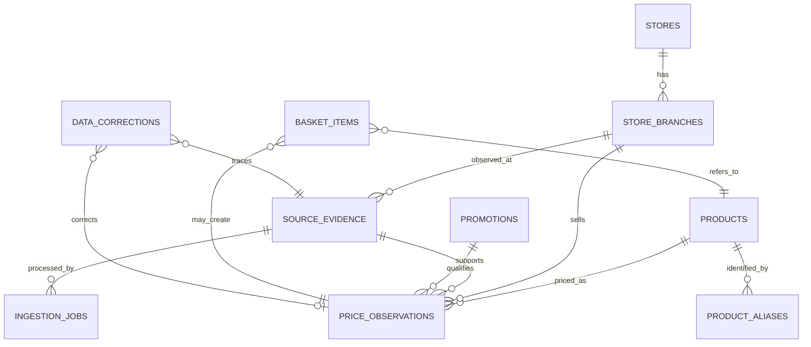

# 将来用価格データモデル

この文書は設計案であり、現時点で本番DBへ適用するSQLではない。

## 境界

- `household_entries`: 本人の家計簿。価格分析へ暗黙転用しない。
- `source_evidence` / `price_observations`: 明示同意または店舗契約に基づく価格分析。
- 元画像、OCR生結果、ユーザー確認済み構造化データを別レコード・別保持期間にする。
- `source_type`は`receipt | flyer | store_manual | store_social | user_manual`に限定する。

## ER図

## 識別方針

### 商品

1. 有効なJANコードを最優先の外部識別子とする。
2. JANがない場合は、正規化商品名、容量、単位、メーカーの組み合わせで候補を出す。
3. 容量違いは別商品。単価比較時だけ共通の基準単位へ換算する。
4. レシート省略名、旧名、表記揺れは`product_aliases`へ出典店舗と有効期間付きで保存する。
5. 類似度だけで自動確定せず、閾値未満・複数候補は確認待ちにする。

### 店舗

- `stores`は企業・屋号、`store_branches`は実店舗を表す。
- 店舗契約は原則支店単位でも、企業と支店の関係は分析・重複防止のため維持する。
- 既存`user_store_id`はユーザーの登録地点識別子であり、将来の正規支店IDとは分離して対応表を持つ。
- 住所変更や閉店でIDを再利用しない。

## カラム案

### `source_evidence`

| カラム | 内容 |
| --- | --- |
| `id uuid` | 内部ID |
| `owner_user_id uuid nullable` | レシート・ユーザー手入力の所有者 |
| `owner_store_id uuid nullable` | 店舗提供データの契約主体 |
| `source_type enum` | 5種の出典 |
| `storage_object_key text nullable` | 非公開Storageの元画像。公開URLは禁止 |
| `source_url text nullable` | 許可済み公式投稿・公式チラシURL |
| `raw_ocr_json jsonb nullable` | OCR生結果。構造化確定値と分離 |
| `content_hash text` | 同一画像・同一投稿の重複候補検出 |
| `captured_at timestamptz nullable` | 撮影日時 |
| `observed_at timestamptz` | 価格を確認した日時 |
| `expires_at timestamptz nullable` | チラシ・SNS・画像の期限 |
| `consent_record_id uuid nullable` | 提供同意の版と時点 |
| `status enum` | uploaded, processing, review, confirmed, rejected, deleted |
| `created_at timestamptz` | 作成日時 |

### `ingestion_jobs`

`id`, `evidence_id`, `processor`、`processor_version`, `started_at`, `completed_at`, `duration_ms`, `status`, `error_code`, `attempt_count`, `sanitized_metrics jsonb`。OCR本文や商品名を運用ログへ複製しない。

### `stores`

`id`, `legal_name`, `display_name`, `brand_key`, `country_code`, `website_url`, `verification_status`, `created_at`, `retired_at`。

### `store_branches`

`id`, `store_id`, `branch_name`, `address_normalized`, `postal_code`, `latitude_approx`, `longitude_approx`, `external_place_ids jsonb`, `status`, `opened_at`, `closed_at`。正確な位置情報へのアクセスは必要最小限にする。

### `products`

`id`, `jan_code nullable unique`, `canonical_name`, `manufacturer`, `quantity_value numeric`, `quantity_unit enum`, `category_code`, `status`, `created_at`。単位はg, kg, ml, l, piece, pack等を制約する。

### `product_aliases`

`id`, `product_id`, `branch_id nullable`, `alias_text`, `normalized_alias`, `source_type`, `valid_from`, `valid_to`, `confidence`, `confirmed_by_user`。同一aliasの候補が複数なら自動確定しない。

### `price_observations`

`id`, `evidence_id`, `branch_id`, `product_id`, `observed_price`, `tax_included`, `quantity_value`, `quantity_unit`, `normalized_unit_price nullable`, `currency`, `observed_at`, `valid_from`, `valid_to`, `promotion_id nullable`, `confidence_score`, `confirmation_status`, `dedup_key`, `created_at`, `deleted_at`。

### `promotions`

`id`, `branch_id`, `title`, `conditions`, `starts_at`, `ends_at`, `member_only`, `quantity_limit`, `source_evidence_id`, `status`。条件付き価格を通常価格と混ぜない。

### `basket_items`

ユーザー確認画面の一時候補。`id`, `owner_user_id`, `evidence_id`, `line_number`, `raw_name`, `candidate_product_id`, `quantity_value`, `quantity_unit`, `price`, `review_status`, `confirmed_at`。確定前は`price_observations`へ入れない。

### `data_corrections`

`id`, `actor_user_id`, `evidence_id`, `observation_id nullable`, `field_name`, `before_value jsonb`, `after_value jsonb`, `reason_code`, `created_at`。機微な元値の複製期間を最小化する。

## RLS案

- 一般ユーザーは自分の`source_evidence`、`basket_items`、`data_corrections`だけ参照・削除できる。
- 店舗アカウントは契約対象`owner_store_id`の店舗提供証跡だけ操作でき、他店舗・ユーザー証跡を参照できない。
- 匿名集計向け`price_observations`はブラウザから直接全件SELECTさせず、最低観測数を満たすSECURITY DEFINER RPCまたは集計ビューだけを公開する。
- OCRワーカーは短命なサーバー資格情報を使い、対象jobとStorage objectだけに限定する。
- `service_role`はEdge Function等のサーバー環境だけに置く。
- 管理者訂正・削除は監査ログ必須。所有者変更は禁止。
- 同意なし、同意撤回済み、期限切れ証跡から新規観測を生成しない。

## 保持期間案

| データ | 初期案 | 削除契機 |
| --- | --- | --- |
| 未確定元画像 | 24時間 | 放棄、明示削除、期限到来 |
| 確定済み元画像 | 確定後即時〜最大7日をユーザー選択 | OCR確定、撤回、期限到来 |
| OCR生結果 | 30日 | 訂正検証終了、撤回 |
| `basket_items`未確定候補 | 7日 | 確定、放棄、撤回 |
| 確認済み価格観測 | 13か月 | 撤回、利用目的終了、法的要請 |
| チラシ・SNS証跡 | 掲載終了後30日 | 契約解除、URL削除依頼 |
| 監査・削除ログ | 13〜25か月 | 法務・運用レビューで確定 |
| バックアップ | 最大30日で失効 | 復元時に削除台帳を再適用 |

保持期間は法務レビューと実測コスト後に短い側へ確定する。削除は論理削除だけで完了とせず、Storage、派生観測、検索索引、バックアップ失効まで削除台帳で追跡する。
